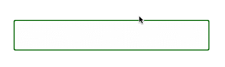

# Readme

- Test in browsers you care about

## Todo

- Add tests
- Add minified version
- Provide examples/
- Add a gh-pages page with an example
- Write a guide
  - can have multiple elements
  - elements can have whatever styles
  - email fields must have IDs
  - fields on which the plugin is initialized are wrapped in .sef-wrapper class

# Smart Email Field

Smart Email Field adds autocompletion of popular email domains to your inputs.  
Right arrow autocompletes the suggestion.



## Demo
http://petarslovic.github.io/smart-email-field/

## Dependencies

No dependencies. Vanilla JS.

## Install

### Get the files
  NPM  
    `npm install smart-email-field --save`

  Bower  
    `bower install smart-email-field --save`

### Include the files in your app

```html
  <script src="smart-email-field.min.js"></script>
```

## Documentation

### Usage

**Important - Email fields must have ID attributes, otherwise the plugin won't work as expected.**  

There are a few ways to instantiate the plugin.  
Given a few email fields:

```html
<input type="email" class="email-field">
<input type="email" class="email-field">
<input type="email" id="email-1">
```

#### Via selector
```js
var smartEmail = new SmartEmailField('.email-field')
```
This will make only the first input into a SmartEmailField. SmartEmailField uses `document.querySelector` if you pass a string.

#### Via DOM Element
```js
var emailElement = document.querySelector('#email-1');
var smartEmail1 = new SmartEmailField(emailElement);
```

#### If you are using jQuery
```js
var $email = $('#emial-1');
var smartEmail1 = new SmartEmailField($email.get(0));
// or
var smartEmail1 = new SmartEmailField($email[0]);
```

#### If you have multiple email fields on the page
```js
[].slice.call(document.querySelectorAll('.my-email')).map(el => new SmartEmailField(el));
```

jQuery:
```js
$('.my-email').each($el => new SmartEmailField($el[0]));
```


### Configuration

To configure SmartEmailField, pass options as the second parameter to constructor:
```js
  var myEmail = new SmartEmailField('#my-email', {
    shadowStyle: {
      color: 'rgba(0, 0, 0, 0.3)'
    }
  })
```

#### Options

- **shadowStyle**  
Set the style of the shadow element. This affects the background color of the email field, or the color of autocomplete text, or any other property.

## How it works

It's pretty simple:  
- we have a email field
- we wrap it with a div
- add a shadow div behind
- copy the styles of email field to shadow div
- make email field's background transparent, so we can see the shadow field
- fill shadow filed with suggestion text

## Development

1. `git checkout gh-pages`
  1. run `npm install && bower install`
  2. write your code then run `grunt`
  3. git commit your changes
2. copy over core files (.js and .css/.less for directives) to master branch
  1. `git checkout master`
  2. `git checkout gh-pages post-message.js post-message.min.js`
3. update README, CHANGELOG, bower.json, and do any other final polishing to prepare for publishing
  1. git commit changes
  2. git tag with the version number, i.e. `git tag v1.0.0`
4. create github repo and push
  1. [if remote does not already exist or is incorrect] `git remote add origin [github url]`
  2. `git push origin master --tags` (want to push master branch first so it is the default on github)
  3. `git checkout gh-pages`
  4. `git push origin gh-pages`
5. (optional) register bower component
  1. `bower register ng-post-message [git repo url]`